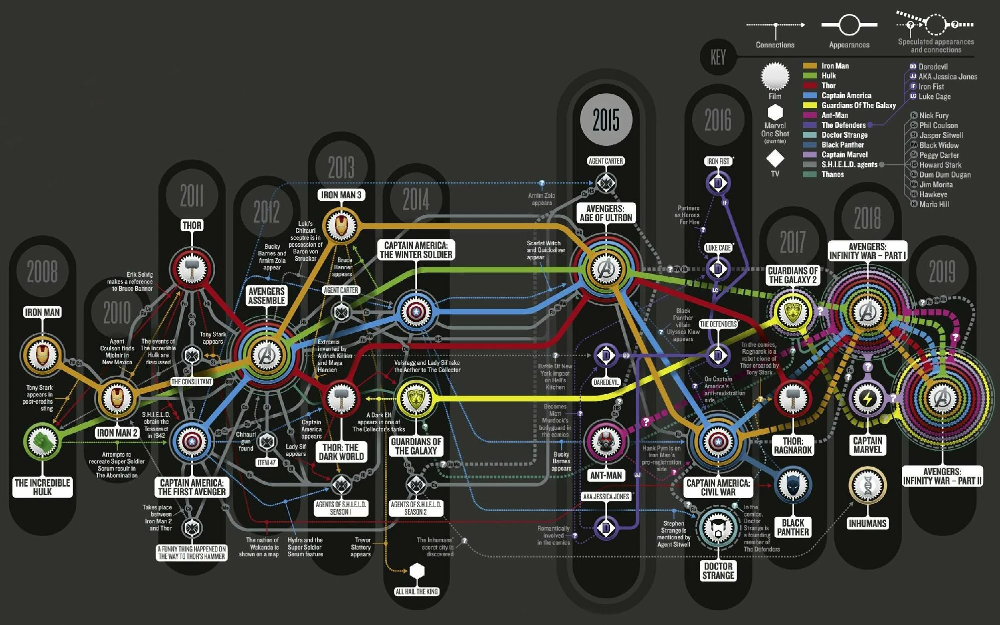

The past cannot predict the future
That is why we have no flying cars
Nor terraformed mars
Though robots may be near

Many paths are always present
More paths created, more possibilities
Yet all paths must lead somewhere
Unless you forget the final 

[A potential look into what the far future holds for the universe](https://youtu.be/uD4izuDMUQA?si=sKaZg5ULFVCEUP9K)
